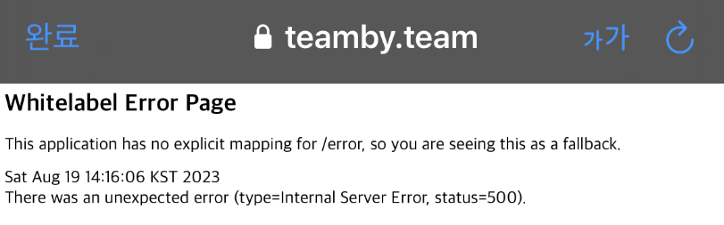
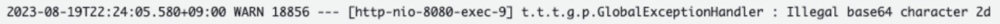
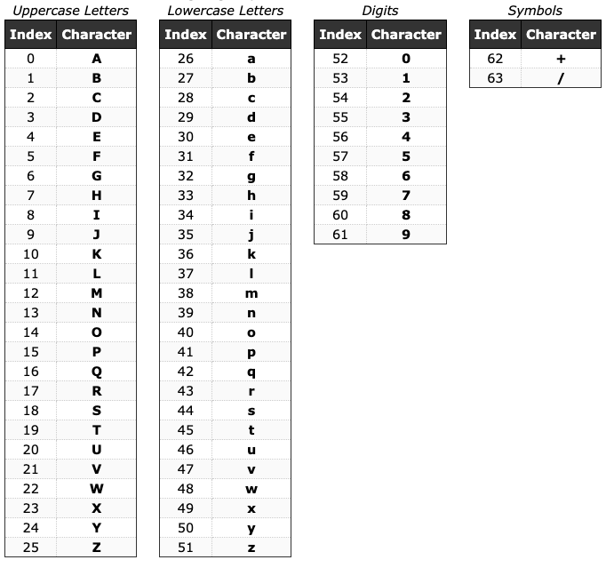
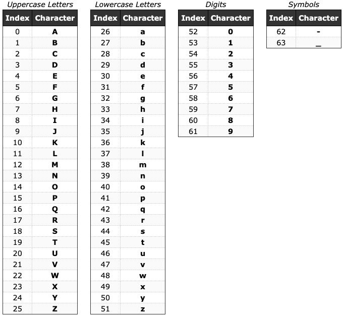
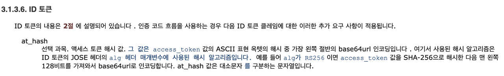

> 해당 글은 우아한테크코스 5기 팀바팀 크루 [성하](https://github.com/sh111-coder)가 작성했습니다!!

<br>

# ❌ 0. 문제 상황

서비스를 배포하고 나서 피드백을 받을 때, 일부 사용자의 구글 로그인이 정상적으로 작동하지 않는 문제가 발생했습니다.



<br>

서버의 로그를 확인해보니, 다음과 같은 에러가 발생하고 있었습니다.


구글 로그인에 관한 에러인데 왜 Base 64 에러가 뜨는지 상당히 궁금했었습니다.

그래서 구글링을 거쳐 **Base64와 Base64Url의 차이**라는 키워드를 알게 되었고,

위의 키워드가 문제 원인 & 해결 방법을 제시해주고 있었습니다.

---

<br>

# 📘 1. Base64와 Base64Url의 차이

Base64와 Base64Url의 차이를 알아보기 전에,

Base64와 Base64Url이 무엇인지 간단하게 살펴봅시다.

<br>

## ✅ 1-1. Base64


**Base64는 8비트 이진 데이터를 텍스트(ASCII 문자)로 인코딩하는 방식 중에 하나입니다.**

파일 및 이미지나 중요한 정보를 Base64를 인코딩 하는 등 여러 컨텍스트에서 다양하게 사용이 가능합니다.


예를 들어, 'Hello, World!'를 Base64로 인코딩하면 SGVsbG8sIFdvcmxkIQ==라는 문자열로 인코딩됩니다.


이때, Base64를 사용하여 URL을 인코딩할 때 문제가 발생할 수 있습니다.


Base64로 URL을 인코딩하게 되면, 62번 63번 문자인 '+'와 '/'의 문자가 인코딩될 수도 있습니다.

URL에서 '+'는 공백을 의미하고 '/'는 Path 구분자의 역할을 수행합니다.

따라서, 인코딩한 URL에 '+', '/'가 포함되면, URL에서 '+'와 '/'가 각각 문자열이 아니라 특별한 역할을 가지게 되어

의도와는 다르게 동작할 수 있습니다.

<br>

따라서, 이를 보완하기 위해 **Base64Url**이 등장하게 되었습니다!


<br>

## ✅ 1-2. Base64Url

Base64Url은 기본적으로 Base64와 인코딩 방식이 똑같습니다.

대신, 위에서 의도와 다르게 동작할 수 있었던 62번, 63번 인덱스가 다른 값으로 변경된 방식입니다.

Base64에서 의도와 다르게 동작할 수 있었던 62, 63번 인덱스인 '+'와 '/'가 '-'와 '_'로 변경된 걸 볼 수 있습니다.

이를 통해 URL을 더욱 안전하게 인코딩 및 디코딩하여 사용할 수 있습니다.

---

<br>

# ❓ 2. 문제 원인

그렇다면, 왜 구글 로그인에서 문제가 발생하고 있었던 걸까요?


한번 천천히 따라가 봅시다.

문제가 발생했던 코드는 다음과 같습니다.

```java
private String extractElementFromToken(final String googleIdToken, final String key) {
    final String payLoad = googleIdToken.split("\\.")[PAYLOAD_INDEX];
    final String decodedPayLoad = new String(Base64.getDecoder().decode(payLoad));
    final JacksonJsonParser jacksonJsonParser = new JacksonJsonParser();
    return (String) jacksonJsonParser.parseMap(decodedPayLoad)
            .get(key);
}
```

구글이 제공하는 사용자 정보인 IdToken을 받아서, 해당 JWT IdToken에서

이메일, 사용자 프로필 사진 등 여러 정보를 추출하는 메소드입니다.


여기서 문제가 발생한 부분은 다음과 같습니다. 
```java
final String decodedPayLoad = new String(Base64.getDecoder().decode(payLoad));
```
구글의 IdToken을 Base64 Decoder로 디코딩하여 정보를 가져오고 있는데요.

왜 여기서 문제가 발생했을까요?

<br>

OpenID Connect 공식 문서의 IdToken 관련 정보를 살펴보면 다음과 같이 나와 있습니다.


마지막 줄에 다음과 같이 나와 있습니다.

> base64url로 인코딩합니다.

구글 IdToken의 정보들은 Base64Url로 인코딩되어 있는데, 애플리케이션 코드에서는 Base64 Decoder를 사용하기 때문에

오류가 발생한 것이었습니다.


그렇다면, 왜 모든 사용자의 구글 로그인이 에러가 발생하는게 아니라 일부 사용자만 발생했을까요?

해당 이유는 위의 Base64와 Base64Url의 차이에 있었습니다!

위에서 살펴봤듯이, 둘의 차이는 62번, 63번 인덱스의 변환값이 다르다는 것이었는데요!


구글이 IdToken을 Base64Url을 사용하여 인코딩할 때 62번 또는 63번 값인 '-', '_'가 포함되지 않는다면

Base64로 디코딩을 해도 전부 디코딩이 가능하기 때문에 오류가 발생하지 않았던 것입니다.


대신, '-', '_'가 포함된다면 Base64로는 해당 값을 디코딩할 수 없기 때문에 에러가 발생한 것입니다.

---

<br>

# ❓ 3. 문제 해결

문제 해결은 정말 간단하게 할 수 있었습니다!

애플리케이션의 코드에서 Base64 Decoder 대신 Base64 Url Decoder를 사용하여

Base64Url로 디코딩을 진행하면 해결할 수 있었습니다!

```java
* 문제 발생 코드 (Base64 Decoding)
  final String decodedPayLoad = new String(Base64.getDecoder().decode(payLoad));

* 해결 (Base64Url Decoding)
  final String decodedPayLoad = new String(Base64.getUrlDecoder().decode(payLoad));
```


---


이번 문제는 운영 서버에서 처음으로 발생한 문제이고, 처음 해본 트러블 슈팅이었습니다.

트러블 슈팅을 하면서 다음과 같은 로그를 보고 추적할 수 있었기 때문에 해결이 가능하다고 생각했습니다.


그래서 Base64와 Base64Url의 차이도 깨닫게 되었지만

더 중요한 것은 로깅 & 모니터링의 중요성을 알게 되었다는 점인 것 같습니다!
