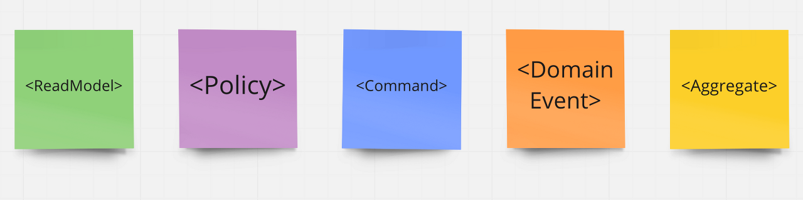
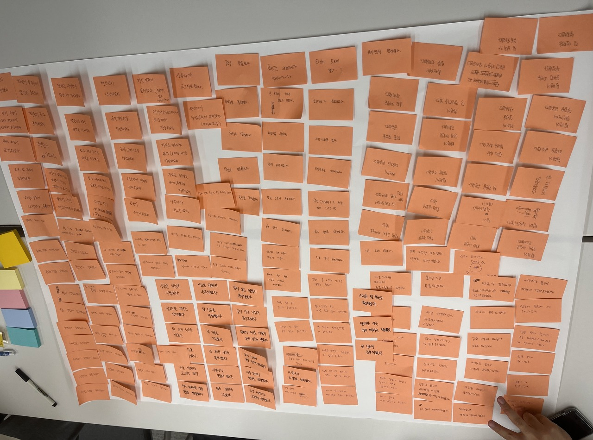
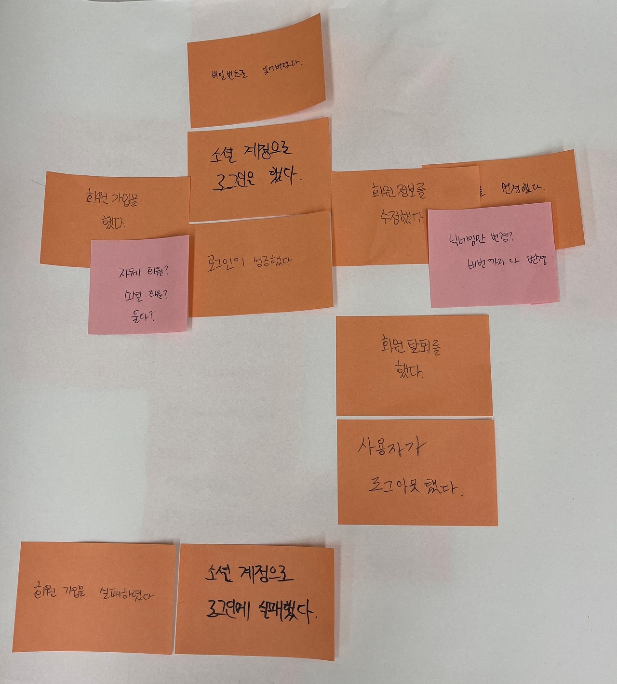
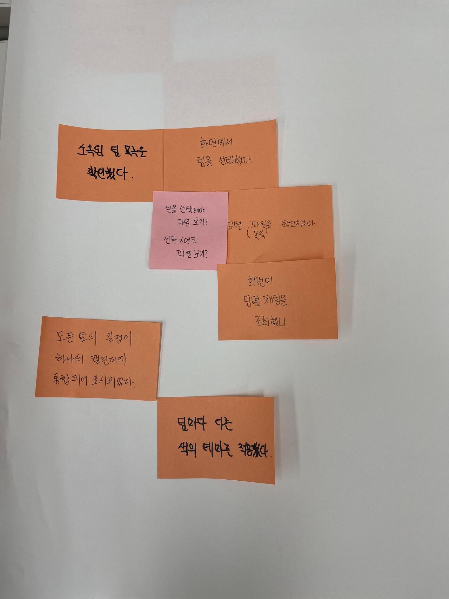
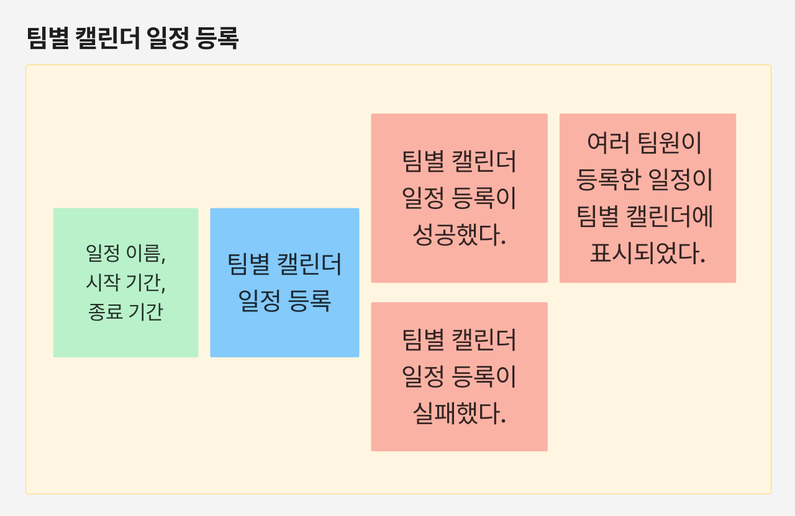
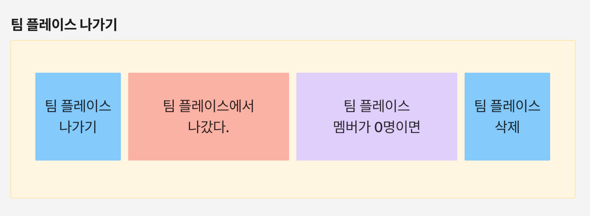
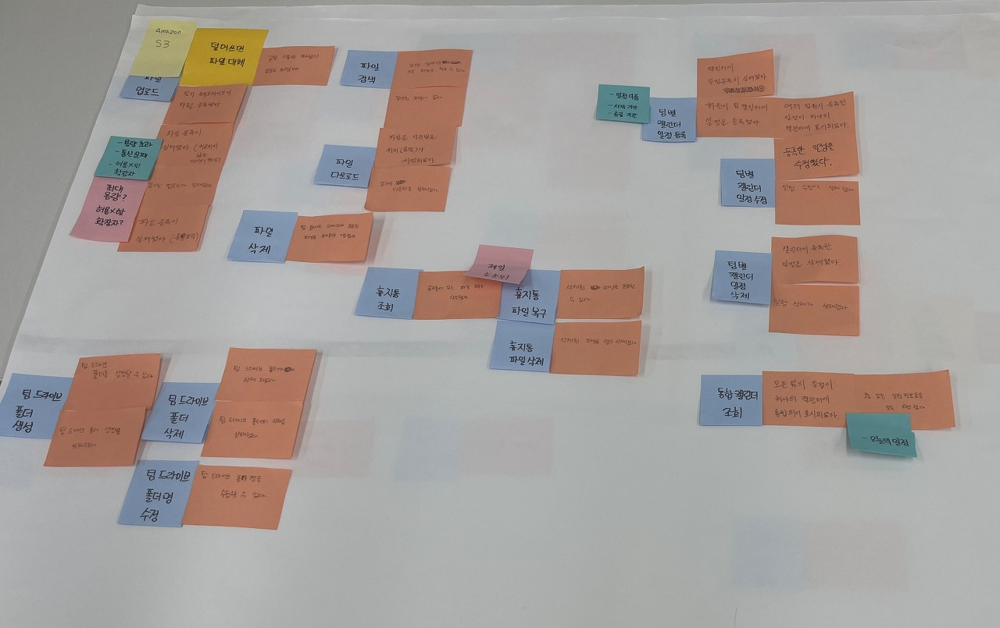
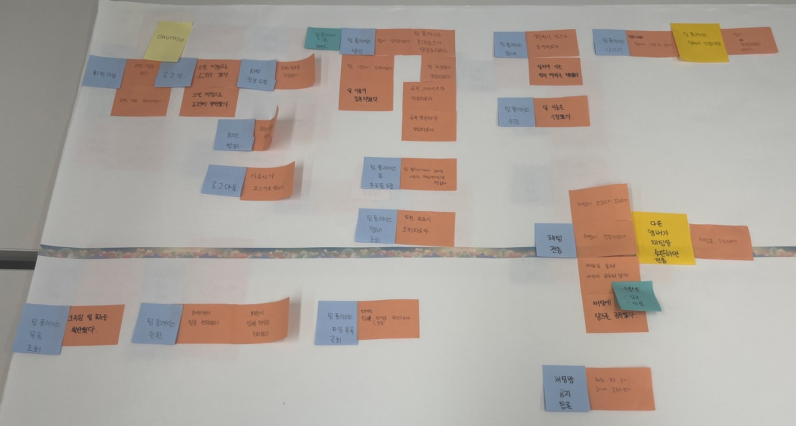
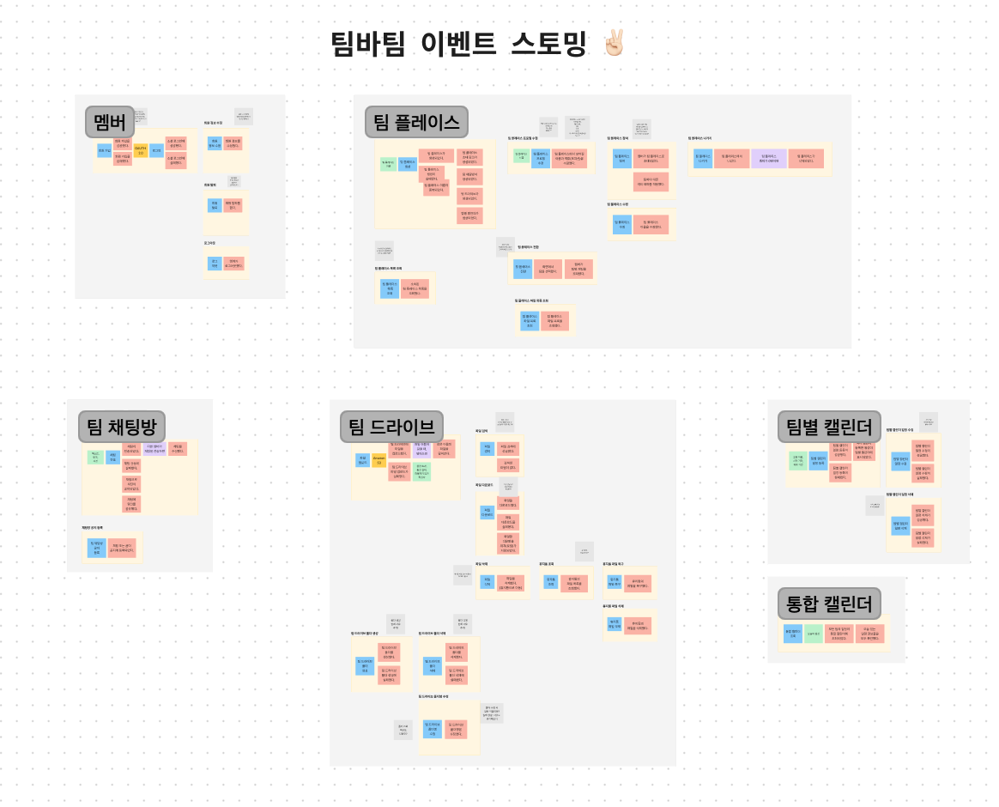
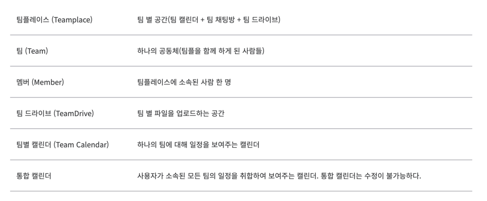

> 해당 글은 우아한테크코스 5기 팀바팀 크루 [성하](https://github.com/sh111-coder)가 작성했습니다!


## 🌈 이벤트 스토밍(Event Storming) 도입기

우아한테크코스 5기 팀바팀 Project에서 Event Storming을 처음 사용해보면서

적용했던 배경과 적용 과정, 적용 후에 느낀점 등을 간단하게 기록하고자 합니다!


## 🎯 이벤트 스토밍 도입 배경

프로젝트 팀원이 배정되기 전에,

DDD에 대해 공부해보면서 자연스럽게 DDD 도입 시 쉽게 DDD를 도입할 수 있는 방법을 접하게 되었습니다.

그게 바로 이벤트 스토밍(Event Storming)이었습니다.

<br>

처음에는 'DDD를 쉽게 할 수 있다고?' 라는 생각으로 이벤트 스토밍에 흥미를 가지고 공부를 해봤습니다.

공부를 한 뒤에 느낀 생각은 다음과 같았습니다.

> DDD 뿐만 아니라 기획, 설계 시에 적용하면 좋겠는데?

뒤에서 소개하겠지만, 이벤트 스토밍을 하고 나면 팀원 모두가 공통된 이해를 가지는 효과때문에

위와 같은 생각을 하게 되었습니다.

<br>

그래서 결국 팀 첫 회의 날에 이벤트 스토밍을 해보자고 주장했고, 도입하게 되었습니다!


## 🎯 이벤트 스토밍이란?

간단하게 이벤트 스토밍에 대해서 설명하고 넘어가겠습니다!

이벤트 스토밍이란, **복잡한 비즈니스 도메인을 빠르게 탐색하고 학습할 수 있는 방법입니다.**

**코드로 소통하지 않고 모든 사람이 공통된 도메인 이해를 가지도록 하는 방법입니다.**

<br>

포스트잇 색상으로 개념들을 구분하고, 해당 개념에 따라 포스트잇을 붙여가면서 도메인 이해를 해나가는 방법입니다.




일반적으로 이벤트 도메인에 사용되는 포스트잇의 색상에 따른 개념은 위의 사진과 같습니다.

간단하게 색상별 개념을 알아보도록 하겠습니다.

```text
1. 주황색 : '도메인 이벤트' - 서비스에서 발생할 수 있는 도메인별 이벤트
2. 노란색 : '액터' - 단순한 사용자, 고객보다 구체적인 페르소나
3. 파란색 : '액션' - 시스템에서 일어나는 일, 도메인 이벤트가 발생하는 원인
4. 초록색 : '정보' - 액터가 액션을 실행하는 데에 필요한 정보
5. 보라색 : '정책' - 도메인 이벤트와 액션 사이에 위치해서 '주로 ~할 때마다'로 시작하는 정책
```
구체적인 색상별 예시는 아래에서 더 설명하겠습니다.


말로만 들으면 어떤 방법인지 감이 안 올 수 있기 때문에,

어떻게 공통된 도메인 이해를 가질 수 있는지 진행 방식 및 과정을 보면서 이해해봅시다.


## 🎯 이벤트 스토밍 진행 방식

이벤트 스토밍을 하기 위한 준비물은 큰 종이나 큰 화이트보드, 포스트잇과 펜 정도면 충분합니다!


이벤트 스토밍은 단계별로 진행됩니다!

여러 참고 자료를 공부해본 결과, 자료마다 포스트잇 색상이 의미하는 개념은 대부분 비슷했지만

어떤 단계로 진행하는 지는 부분부분 달랐습니다.


저희 팀은 아래의 영상에 나오는 단계를 참고하여 진행했습니다!
참고는 했지만,

처음 진행해본 것이기도 하고 부분적으로 단계별로 진행하지 않았던 부분도 있어서 완전히 똑같게 진행하지는 않았습니다!

[KCD 2020 TRACK 2 : 도메인 지식 탐구를 위한 이벤트 스토밍](https://www.youtube.com/watch?v=hUcpv5fdCIk&ab_channel=OpenUP-%EC%98%A4%ED%94%88%EC%97%85) 

그럼, 저희 팀에서 이벤트 스토밍을 진행했던 단계를 경험 기반으로 소개해보겠습니다!

(단계 이름은 제 맘대로 정해보겠습니다!)

### ✅ 1단계 : 도메인 이벤트 흩뿌리기

1단계에서는 팀의 서비스에서 발생할 수 있는 이벤트들을 **주황색 포스트잇**에 생각나는대로 적어서 붙이는 단계입니다.

저희 서비스는 '여러 팀플 참여 시 쉽게 협업을 할 수 있도록 도와주는 서비스'이므로,

다음과 같은 이벤트가 공통적으로 발생합니다.

(아래 이벤트만 있는 것이 아니라 무수히 많은 이벤트가 발생하겠죠?!)

```text
1. 로그인이 성공하였다.
2. 팀 플레이스가 생성되었다.
3. 팀별 캘린더 일정 등록이 성공하였다.
```

이처럼, 각자의 생각으로 서비스에 맞는 도메인의 이벤트들을 적어서 붙이면 됩니다.


이때, 하나의 큰 종이에 포스트잇을 붙여나가면서 다른 팀원들의 이벤트를 볼 수는 있지만

'그 이벤트가 필요할까?'와 같은 토론은 지양하고, 팀원들 각각 자신의 생각대로 이벤트를 적어서 붙입니다.

저희 팀 같은 경우는 1단계 마무리 시 다음과 같이 큰 종이에 빽빽하게 채워질 만큼의 도메인 이벤트가 도출되었습니다.




### ✅ 2단계 : 도메인 이벤트 타임 라인 순으로 정리 & 토론 시작

1단계를 마무리했다면, 수많은 도메인 이벤트가 큰 종이에 붙어있을 것입니다.

2단계가 이벤트 스토밍의 Main 단계라고 생각이 듭니다.


2단계에서는 1단계에서 팀원들이 각각의 생각대로 도출한 도메인 이벤트를 타임 라인 순으로 정리합니다.

타임 라인 순으로 정리하면서 중복이라고 생각되는 이벤트들은 제거합니다.

정리를 해나가면서, 팀원들과 토론이 필요한 부분은 토론하면서 필요한 이벤트들만 남겨놓습니다.


도메인 이벤트를 중복이라고 여겨서 제거할 때 중요한 점은,

**동일한 용어인 이유로 중복일 때 다른 개념일 수 있으므로 100% 중복인 도메인 이벤트만 제거해야합니다.**


예를 들어, 팀원 A와 B가 똑같이 '로그인이 성공했습니다.' 이벤트를 작성했을 때,

A는 자체 로그인으로 생각했고, B는 소셜 로그인으로 생각했다면 이 두 개의 이벤트는 다른 이벤트입니다.

따라서 제거하는 것이 아니라 구체화해야 할 것입니다.


이렇듯, 도출한 이벤트를 제거할 때는 100% 중복이 맞는지 확인 후에 제거해야합니다.


이 단계에서 한 가지 더 중요한 포인트는 바로 **토론을 시작한다는 점**입니다!

도메인 이벤트에 대한 토론을 시작하면서 많은 갈등 및 충돌이 발생할 것입니다!


**이때, 자주색 포스트잇을 이용하여 어떤 부분에서 토론을 했는지에 대해 토론을 한 도메인 이벤트 옆에 붙여주는 것이 중요합니다.**

**이후에 자주색 포스트잇에 적혀있는 토론 부분들을 해결해 나가면서 공통된 이해를 도출할 수 있습니다!**


다음은 저희 팀이 진행한 2단계 결과입니다.

저희 팀의 경우에는 분홍색 포스트잇에 용어 후보들이나, 해당 기능을 넣을지 말지 등의 고민들을 적어 놓고

이후에 해당 포스트잇을 보고 해결해나갔습니다.

(자주색 포스트잇이 없어서 불가피하게 분홍색 포스트잇으로 토론이 발생한 부분을 나타냈습니다.)





### ✅ 3단계 : 액터 & 액션 & 리드 모델 & 정책 설정 + 토론 결론 내기

2단계를 거쳐서 타임 라인이 결정된 이후에 저희 팀은 다시 한번 도메인 Flow를 하나씩 살펴보며

액터 & 액션 & 리드 모델 & 정책을 생각나는 대로 개념에 맞는 포스트잇 색상으로 붙여나갔습니다.


보통의 2단계에서는 노란색 포스트잇으로 **구체적인 사용자 페르소나를 뜻하는 액터**를 설정하지만,

저희 팀은 서비스 Flow에서 액터가 거의 '멤버' 1개라고 생각했기 때문에, 따로 액터 포스트잇은 붙이지 않았습니다.


다음으로, **도메인 이벤트가 발생하는 원인인 액션**을 파란색 포스트잇으로 붙여나갔습니다.

붙어져 있는 모든 도메인 이벤트들의 액션을 생각해보며 자연스럽게

**액터가 액션을 내리는데 필요한 정보**를 초록색 포스트잇으로,

**도메인 이벤트와 액션 사이에 위치한 정책**을 진한 노랑색 포스트잇으로 붙여나갔습니다.

(원래는 정책은 보라색 포스트잇이지만 없어서 진한 노랑색 포스트잇으로 대체했습니다.)


정보, 정책 개념에 대해 사용했던 예시를 들어보자면 다음과 같이 들어볼 수 있습니다.
```text
1. 정보 : '팀별 캘린더 일정 등록' 액션을 하기 위해 필요한 정보
    - 일정 이름
    - 시작 기간
    - 종료 기간

2. 정책 : 도메인 이벤트와 액션 사이에 위치해서 도메인 이벤트가 발생할 때마다 액션을 수행하게 하는 트리거
    - '팀 플레이스에서 나갔다' 도메인 이벤트가 발생할 때, '팀 플레이스가 삭제되었다.'가 수행되는 조건
    - '팀 플레이스 멤버가 0명이면' : 정책
```




이 단계에서는 액션, 정보, 정책 붙이기 이외에 더 중요한 작업이 있었습니다.

중요한 작업은 바로, 2단계에서 붙여놨던 토론 부분들을 다시 살펴보면서 해결해나가는 과정입니다.

이를 통해 용어나 해당 기능의 개발 여부 등 여러 갈림길들을 하나의 길로 만들어서 싱크를 맞췄습니다.


저희 팀은 이러한 3단계 과정 끝에 공통된 도메인 이해를 가지고 개발 단계에 접어들 수 있었습니다!

다음은 완성한 저희 팀의 이벤트 스토밍 결과물입니다!

(최소 기능들만 우선 구현하자는 공동의 목표로 가지고 임했기 때문에 이벤트들을 많이 제거하게 되었습니다.)




## 🎯 피그잼에 이벤트 스토밍 결과 옮기기

저희 팀은 **오프라인**으로 이벤트 스토밍을 진행했습니다.

이때 1단계에서 진행한 도메인 이벤트 포스트잇은 공통된 '유비쿼터스 언어'를 정의하기 전에 작성된 것이기 때문에

용어들이 공통된 용어로 작성되지 못했습니다.


예를 들면, 이벤트 스토밍이 끝난 후에는 '파일 업로드 하는 공간'을 '팀 드라이브'로 정의를 마쳤는데,

1단계에서 작성한 주황색 포스트잇에서는 '공유 드라이브'라는 용어로 표현되어 있는 경우가 많았습니다.

이러한 이유 때문에 온라인으로 옮기면서 용어를 공통된 용어로 수정해야겠다고 생각했고,


또한 이미 작성했던 포스트잇 부분에 변경 사항이 생기거나 추가할 필요가 생길 때

불편한 점이 많다고 느끼게 되어서 디자인 툴인 피그잼에 이벤트 스토밍 결과를 옮기게 되었습니다.


그렇다고 해서, **오프라인에서 직접 포스트잇을 붙이며 진행한 이벤트 스토밍이 의미가 없다고 생각하지는 않습니다.**

오히려 7명의 팀원이 각자의 화면에서 이벤트 스토밍을 진행했다면

집중이 분산되어서 결과물의 퀄리티가 더 낮아졌을 것이라고 저는 느꼈습니다!


또한, 오프라인으로 진행한 이벤트 스토밍 결과를 온라인으로 옮길 때

한번 더 설계한 서비스의 Flow를 되새기면서 놓쳤던 부분을 발견해서 더 나은 설계가 되기도 했습니다.


다음은, 피그잼으로 옮긴 저희의 이벤트 스토밍 결과물입니다.



## 🎯 이벤트 스토밍 진행 후 느낀점

저희 팀 프로젝트 진행 전에 이벤트 스토밍을 스스로 도입해야겠다고 생각했던 이유는

앞에서도 말했듯이 DDD를 하기 위함이 아닌, **팀원 모두가 공통된 이해를 가지는 효과**를 얻기 위해서였습니다.


**저희 팀에 맞게 줄인 이벤트 스토밍의 3단계를 진행하고 나서 경험한 바로는**

**팀원 모두가 공통된 이해를 가지는 효과를 경험해봤습니다! 😃 👍**

**그래서 너무 만족하게 되었습니다!**


이벤트 스토밍 진행 중이나, 끝나고 난 후에 팀원들이 모두

우리가 이벤트 스토밍을 진행하면서 정한 공통의 언어인 **유비쿼터스 언어**를 사용하고 있었고,

기능 구현 우선 순위나 해당 기능의 정책 등 여러 결정 사항이 도출되었습니다.


아래는 저희 팀이 이벤트 스토밍에서 정립한 저희 팀의 **용어 사전**입니다.


### 📕 용어 사전




이렇듯, 처음 진행해서 미숙했음에도 불구하고 **팀원 모두가 '공통된 이해'를 가지고,**

**기록까지 남아있다는 점에서 아주 좋은 방법이라고 생각했습니다! 👍**
