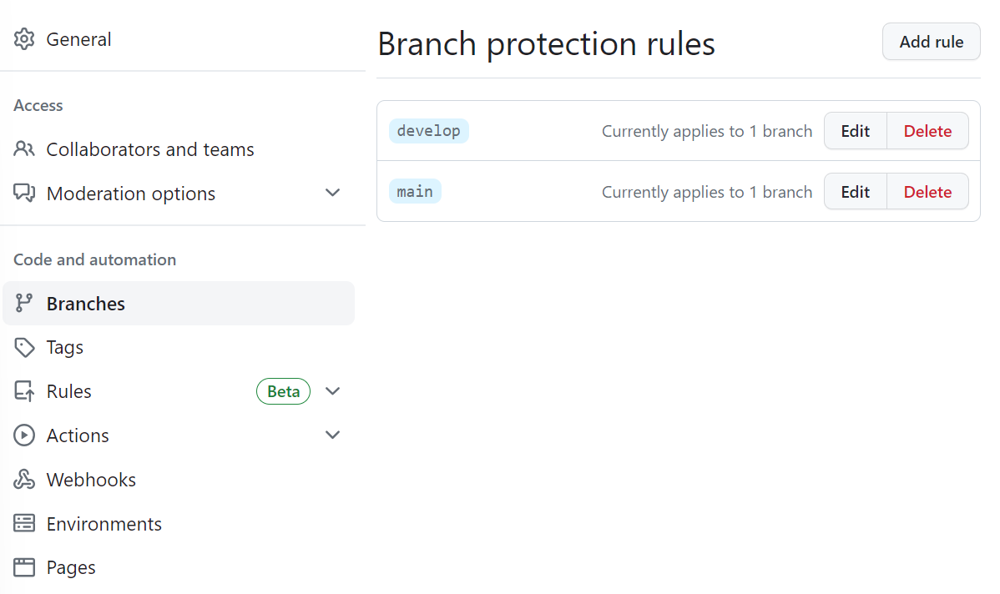

> 해당 글은 우아한테크코스 5기 팀바팀 크루 [루루](https://github.com/hafnium1923)가 작성했습니다!

# 프론트엔드 Github Action 테스트 자동화

팀바팀은 github action을 이용해 프론트엔드 PR시 테스트를 잘 통과하는지 자동으로 테스트하고 있다. 또한, 추후에 Build시 빌드가 잘 되는지 자동으로 테스트할 예정이다. 테스트 자동화를 하면 여러명이 하나의 프로젝트를 같이 진행하는 만큼 나의 코드가 기존의 테스트에 영향을 주는지 사람이 직접 확인하지 않아도 쉽게 확인할 수 있다. 테스트가 통과하지 못한다면 merge를 하지 못하게 막아 merge시 안전성을 높일 수 있다.

# Github Action을 이용한 테스트 자동화

github workflows의 하위에 다음과 같은 파일을 넣는다. 확장자는 `.yml`이다.

자세한 내용은 아래 주석으로 작성했다.

```jsx
name: frontend-ci //액션의 이름

on:
  pull_request: //PR 요청일 때
    branches:
      - develop //해당 브랜치에서 PR이벤트가 일어났을 때 실행 
    paths:
      - frontend/** //frontend하위 폴더에서 작업이 일어날때만 실행

jobs:
  unit-test:
    runs-on: ubuntu-latest //어떤 머신으로 실행할건지
    permissions:
      contents: write //GITHUB_TOKEN에 부여된 기본 사용 권한
    concurrency: //동시성 제어
      group: ${{ github.workflow }}-${{ github.ref }} //동시성을 제어할 그룹 설정
      cancel-in-progress: true //동시에 돌아가게 된다면 가장 최신의 워크플로우 실행
    env:
      working-directory: ./frontend //어디에서 커맨드를 실행 할 건지 

    steps:
      - name: Checkout
        uses: actions/checkout@v3

      - name: Setup node with cache //종속성 파일 캐싱하기.(각 PR 별로 생성된다) 
        uses: actions/setup-node@v3
        with: //캐싱하는 방법
          node-version: 18
          cache: 'npm'
          cache-dependency-path: '**/package-lock.json'

      - name: Install dependencies //종속성 설치하기
        run: npm ci
        working-directory: ${{ env.working-directory }}

      - name: Run unit test //테스트 실행하기
        run: npm run test:ci 
        working-directory: ${{ env.working-directory }}
```

캐싱 관련해서는 아래 자료 참고하면 더 자세히 알 수 있다.

[Caching dependencies to speed up workflows - GitHub Docs](https://docs.github.com/en/actions/using-workflows/caching-dependencies-to-speed-up-workflows)

[GitHub Actions: Setup-node supports dependency caching for projects with monorepo and pnpm package manager](https://github.blog/changelog/2021-09-07-github-actions-setup-node-supports-dependency-caching-for-projects-with-monorepo-and-pnpm-package-manager/)

# PR Merge 막기

열심히 테스트 자동화를 했는데 테스트 실패한 PR이 merge되면 무슨 소용이 있을까. 다행히 github에서는 테스트가 통과하지 못하면 merge 하지 못하게 해주는 설정이 있다.

## 레포 설정 → 브랜치



팀바팀은 개발용 브랜치 develop과 배포 브랜치 main를 사용하기 때문에 이렇게 두개가 올라가 있다. 처음 룰을 등록한다면 오른쪽 위에 있는 Add rule을 눌러 추가한다.

아래 내려서 이 항목을 체크해주면 끝!

