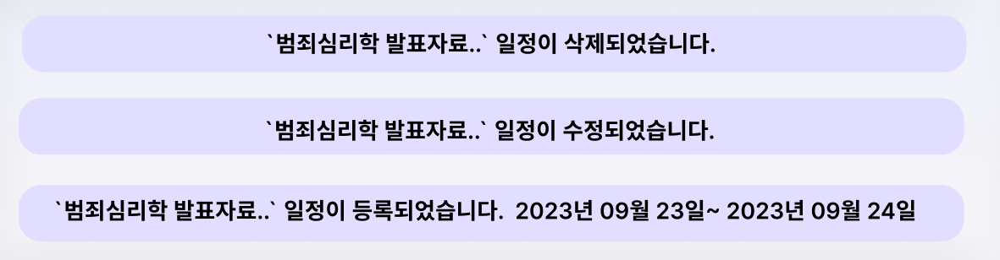
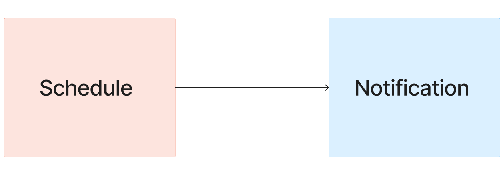
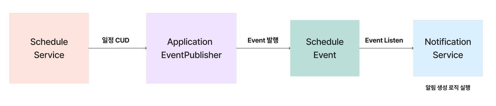
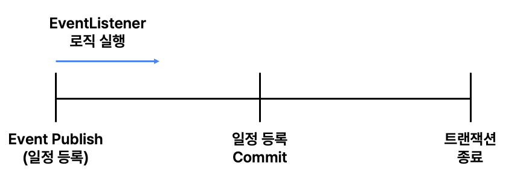
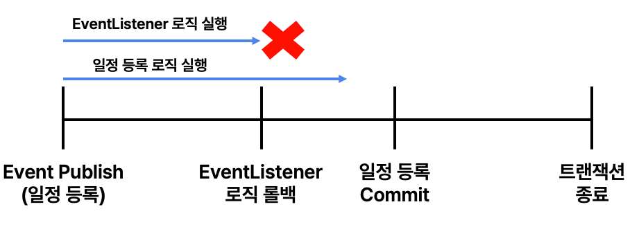
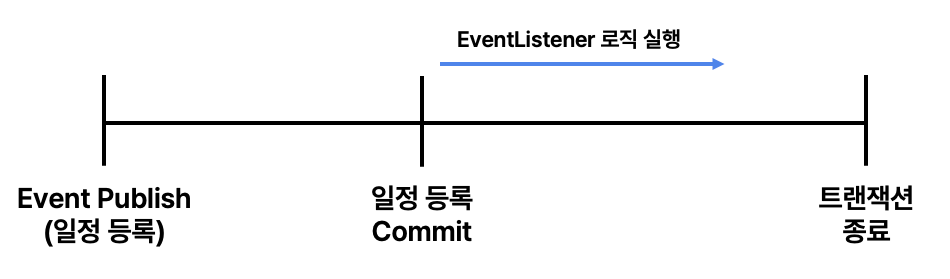
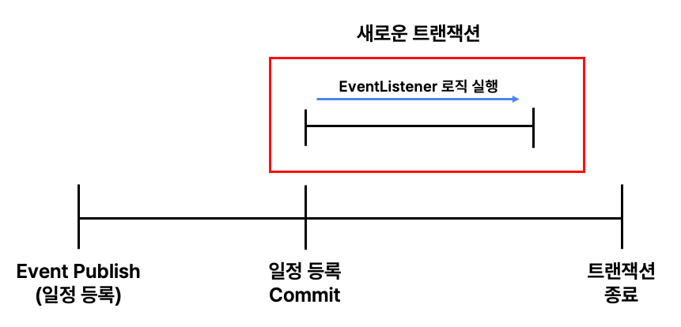

> 해당 글은 우아한테크코스 5기 팀바팀 크루 [성하](https://github.com/sh111-coder)가 작성했습니다!!

<br>

프로젝트를 진행하던 중 스프링 이벤트를 사용하게 되었습니다!


왜 스프링 이벤트를 사용했는지, 어떻게 사용하는지, 사용 시 고려할 점 등에 대해 자세히 알아보도록 하겠습니다!

---

## 0. 스프링 이벤트 도입 배경
   프로젝트를 진행하면서 다음과 같은 요구사항이 존재했습니다.

> 팀 캘린더의 일정이 등록, 수정, 삭제되면 팀 피드에 일정 알림이 생성된다.



위의 디자인처럼 팀 피드 공간에 팀 캘린더의 일정이 등록, 수정, 삭제되면 알림이 생성되도록 하는 요구사항이었습니다.

(여기서 알림은 실시간 알림이 아니라 게시글처럼 생성되는 알림을 의미합니다.)


<br>


스프린트를 거쳐서 팀 캘린더의 일정 등록, 수정, 삭제 로직은 구현되어 있는 상태였으므로

처음에는 단순하게 일정 알림 기능을 추가하면 된다고 생각해서 팀 캘린더 서비스에 다음과 같이 로직을 추가했습니다.


```java
@Service
@Transactional
@RequiredArgsConstructor
public class TeamCalendarScheduleService {

    private final ScheduleRepository scheduleRepository;
	
    // 일정 알림 Service 의존성 추가
    private final NotificationService notificationService;
	
	public Long register(...) {
        // 기존 일정 등록 로직
        ...
        
        // 일정 알림 생성 로직 추가
        notificationService.create(...);
    }

	public void update(...) {
        // 기존 일정 수정 로직
        ...
        
        // 일정 알림 생성 로직 추가
        notificationService.create(...);
    }


	public void delete(...) {
        // 기존 일정 삭제 로직
        ...
        
        // 일정 알림 생성 로직 추가
        notificationService.create(...);
    }
    
    ...
}
```


알림 생성 로직을 추가하고 생각을 해보았을 때 다음과 같은 문제가 생겼습니다.

* **Schedule과 Notification 도메인 간의 강한 결합도**
* **TeamCalendarScheduleService의 단일 책임 원칙(SRP) 위반**



<br>

### 0-1. Schedule과 Notification 도메인 간의 강한 결합도
먼저, Schedule 로직에 Notification 도메인 생성 로직이 존재하기 때문에 Schedule과 Notification이 강한 결합을 가지게 되었습니다.


두 개의 도메인이 라이프 사이클이 비슷하거나 동일한 제약 사항을 공유한다면 결합을 가져도 괜찮다고 생각하지만,


Schedule과 Notification 도메인은 라이프 사이클이 비슷하지 않고, 동일한 제약 사항도 공유하지 않습니다.


이러한 상황에서 이후에 Notification의 생성 로직이 변경된다면 Schedule의 등록, 수정, 삭제 로직에 직접적인 영향을 미치게 될 것입니다.


**따라서 서로 다른 두 도메인이 강한 결합도를 가져서 재사용성과 유지보수성이 떨어지게 됐습니다.**


<br>

### 0-2. TeamCalendarScheduleService의 단일 책임 원칙(SRP) 위반
다음으로 ScheduleService의 단일 책임 원칙이 위반되었다고 생각했습니다.


현재 구조에서는 ScheduleService, 즉 Schedule이 Notification을 생성하는 책임을 가지게 됩니다.


일정의 입장에서 알림에 대해서는 알 필요가 없다고 생각했기 때문에


Schdule -> Notification의 의존성을 없애는 것이 좋다고 생각하게 되었습니다.


<br>


위의 2가지 이유로 의존성을 없앨 수 있는 방법에 대해서 생각해보게 되었고,


이전에 도메인 간의 의존성을 없앨 수 있는 방법인 스프링 이벤트에 대해 들어보았기 때문에 적용을 해보기로 했습니다!

---

## 1. 스프링 이벤트를 사용해서 의존성 분리하기
   어떻게 스프링 이벤트를 사용하면 도메인 의존성을 분리할 수 있을까요?


그림으로 요약해서 도식화해보면 다음과 같습니다.




ScheduleService와 NotificationService 간의 의존성을 위와 같이 Event를 통해 해결할 수 있습니다.


ScheduleService에서 일정이 등록, 수정, 삭제되면 NotificationService의 알림 생성 로직을 실행하는 것이 아니라,


ScheduleEvent를 발행하기만 하고, ScheduleEvent가 발행되면 NotificationService에서 알림 생성 로직을 실행합니다.


**이를 통해 Schedule이 Notification을 의존하는 문제를 해결할 수 있었고,**


**ScheduleService에서는 Notification의 로직을 알 필요 없이 이벤트만 발행하면 되었습니다.**


<br>


### ✅ ApplicationEventPublisher
```java
@FunctionalInterface
public interface ApplicationEventPublisher {

	default void publishEvent(ApplicationEvent event) {
		publishEvent((Object) event);
	}

	void publishEvent(Object event);
```

**이벤트를 발행할 곳에서 ApplicationEventPublisher의 publishEvent()를 통해서 이벤트를 발행할 수 있습니다.**


스프링 4.2 이전에는 default 메소드밖에 없어서 Event 객체를 사용하려면 ApplicationEvent를 상속해야 했습니다.


하지만 스프링 4.2 이후에는 일반 Object를 파라미터로 받는 publishEvent()가 추가되어

일반 객체로도 이벤트를 생성할 수 있게 되었습니다.


<br>


### ✅  @EventListener
**이벤트가 발행되면, @EventListener 어노테이션이 선언된 메소드에서 이벤트를 Listen해서 실행하게 됩니다.**


**해당 메소드에서 발행 시에 파라미터로 넘겨준 Event 객체를 전달하여 로직에 사용할 수 있습니다.**

```java
@EventListener
public void executeEvent(final Event event) {
...
}
```


간단하게 스프링의 이벤트 발행 - 실행 Flow를 요약하면 다음과 같습니다.

1. ApplicationEventPublisher가 publishEvent()로 이벤트 발행
2. ApplicationContext가 발행된 이벤트를 @EventListener가 붙어있는 메소드에 전달
3. @EventListener 메소드 로직 실행


2번 과정을 살펴보면, ApplicationContext가 등장하게 됩니다.

ApplicationContext 클래스를 들어가보면, 다음과 같이 ApplicationEventPublisher를 상속받고 있습니다.
```java
public interface ApplicationContext extends ApplicationEventPublisher, ... {

}
```

따라서, 스프링이 실행되어 ApplicationContext가 로드됐을 때

이벤트가 발행되면 ApplicationContext에서 @EventListener의 메소드를 실행하게 됩니다.

<br>

이렇게 스프링 이벤트의 이론적인 부분을 알아봤습니다!

그렇다면 구체적으로 스프링 이벤트를 사용하여 리팩토링한 코드를 살펴봅시다!

---

## 2.  스프링 이벤트를 사용해서 기존 코드 리팩토링

<br>

### ✅ ScheduleService
```java
@Service
@Transactional
@RequiredArgsConstructor
public class TeamCalendarScheduleService {

    private final ScheduleRepository scheduleRepository;
	
    // ApplicationEventPublisher 추가
    private final ApplicationEventPublisher eventPublisher;
	
	public Long register(...) {
        // 기존 일정 등록 로직
        ...
        
        // ScheduleCreateEvent 발행 로직 추가
        eventPublisher.publishEvent(new ScheduleCreateEvent(...));
    }

	public void update(...) {
        // 기존 일정 수정 로직
        ...
        
        // ScheduleUpdateEvent 발행 로직 추가
        eventPublisher.publishEvent(new ScheduleCreateEvent(...));
    }


	public void delete(...) {
        // 기존 일정 삭제 로직
        ...
        
        // ScheduleDeleteEvent 발행 로직 추가
        eventPublisher.publishEvent(new ScheduleCreateEvent(...));
    }
    
    ...
}
```

ScheduleService에서 NotificationService가 아닌

이벤트 발행 객체 ApplicationEventPublisher를 사용해서 각 로직마다 이벤트를 발행해줬습니다.

<br>


### ✅ ScheduleEvent
```java
@Getter
public abstract class ScheduleEvent {

    private final Long scheduleId;
    private final Long teamPlaceId;
    private final Title title;
    private final Span span;

    ...
}
```

발행하는 ScheduleEvent는 NotificationService에서 알림 생성 시 필요한 정보만 담아서 구현했습니다.


<br>


### ✅ NotificationService
```java
@Service
@Transactional
@RequiredArgsConstructor
public class NotificationService {

    private final NotificationRepository notificationRepository;

    @Transactional(propagation = Propagation.REQUIRES_NEW)
    @TransactionalEventListener
    public void createScheduleNotification(final ScheduleEvent scheduleEvent) {
        ...
    }
}
```

NotificationService에서는 Event를 받아서 로직을 실행하기 위해

@EventListener를 사용하여 이벤트가 발행되면 ApplicationContext에서 해당 메소드를 실행하도록 설정했습니다.

(왜 @EventListener가 아닌 @TransactionalEventListener를 사용했는지와

@Transactional의 propagation을 설정한 이유는 아래에서 설명하도록 하겠습니다!)

---

## 3.  스프링 이벤트 사용 시 고려할 점


위처럼 생각보다는 간단하게 코드 리팩토링을 진행할 수 있었습니다.

하지만, 간단했던 코드 구현과는 달리 스프링 이벤트를 사용할 때는 고려할 점이 많았습니다!

이번 프로젝트의 스프링 이벤트를 사용할 때 고려했던 점들을 나열해보도록 하겠습니다.

<br>

### 3-1. Event 발행 후에 EventListener 로직을 바로 실행해도 되는가? (@TransactionalEventListener)





@EventListener를 사용한다면, 이벤트가 발행되는 시점에 바로 EventListener의 로직이 실행되게 됩니다.

따로 EventListener의 로직 실행 시점을 특정해서 설정할 수 없습니다.


이때 문제가 되는 것은, EventListener의 로직에서 예외가 발생했을 때의 상황입니다.

예외가 발생하게 되면 트랜잭션이 롤백이 되는데 아래의 상황을 살펴봅시다.



순서대로 살펴봅시다.

1. 일정 등록되어 이벤트 발행
2. 이벤트가 발행되어 EventListener 로직 실행
3. 일정 등록 메소드 안에서 다른 로직 수행
4. 일정 등록 메소드가 종료되기 전 (Commit 되기 전) EventListener에서 예외가 발생하여 롤백

이 경우는 EventListener 로직인 일정 알림 로직에 예외가 발생하여 롤백이 된 경우입니다.

이때 일정 등록이 Commit이 되지 않았기 때문에 일정 알림 로직에 예외가 발생해서 롤백이 되는 건데

일정 등록 로직까지 롤백이 되는 상황이 발생합니다.


만약 해당 상황이 정상적인 경우는 그대로 @EventListener를 사용해도 되지만,

저희 프로젝트에서는 일정 알림의 예외로 인해 일정의 등록, 수정, 삭제가 롤백되는 것은 비정상적인 상황으로 봤기 때문에

다른 해결책을 찾게 되었습니다.

<br>

### ※ @TransactionalEventListener
이 상황을 해결할 수 있는 것이 바로 @TransactionalEventListener입니다.

위에서 언급했듯이 @EventListener를 사용할 때는 EventListener의 실행 시점을 지정할 수 없었습니다.

@EventListener 대신 @TransactionalEventListener를 사용하면 트랜잭션 기준으로 실행 시점을 정할 수 있습니다.


@TransactionalEventListener에서 phase 속성을 지정하면 실행 시점을 변경할 수 있습니다.

```text
1. BEFORE_COMMIT: 이벤트 발행 로직이 커밋되기 전에 실행
2. AFTER_COMMIT : 이벤트 발행 로직이 커밋된 후에 실행 (기본값)
3. AFTER_ROLLBACK : 이벤트 발행 로직이 롤백된 후에 실행
4. AFTER_COMPLETION : 이벤트 발행 로직이 커밋 or 롤백된 후에 실행
```
   

4가지 옵션으로 실행 시점을 변경할 수 있습니다.


위의 상황을 방지하기 위해서는 일정 등록, 수정, 삭제 로직이 커밋된 후에 일정 알림 로직이 실행되어야 합니다.

이렇게 설정을 하면 일정 알림 로직에서 예외가 발생하여 롤백이 되어도 일정 등록, 수정, 삭제는 이미 커밋이 되었으므로

데이터가 롤백되지 않을 것입니다.


따라서 프로젝트에서는 @TransactionalEventListener의 기본값인 AFTER_COMMIT를 사용했습니다!


<br>

### 3-2. @TransactionalEventListener를 사용한 상황에서, 데이터를 쓰는 로직이 있는가?
@TransactionalEventListener를 사용할 때 AFTER_COMMIT 옵션을 사용하면 다음과 같은 상황이 됩니다.



일정 등록 로직이 Commit된 이후에, EventListener의 로직이 실행됩니다.

**이때 주의해야 하는 점이 트랜잭션에서 이미 Commit이 되었기 때문에 해당 트랜잭션에서는 조회밖에 수행할 수 없습니다.**


그래서 EventListener 로직에 데이터를 insert, update, delete하는 로직이 존재한다면 해당 로직을 반영할 수 없습니다.


이때, @Transactional의 propagation을 REQUIRES_NEW로 설정하게 되면 이를 해결할 수 있습니다.


<br>

### ※ @Transactional(propagation = Propagation.REQUIRES_NEW)
@Transactional의 Propagation.REQUIRES_NEW는 해당 어노테이션이 붙은 메소드 호출 시

매번 새로운 트랜잭션을 시작하게 됩니다.

따라서, 트랜잭션 자체가 분리되기 때문에 이후 EventListener 로직의 Commit을 수행할 수 있습니다.




저희 프로젝트에서는 EventListener 로직이 일정 알림을 생성해서 insert 하는 로직이 있었기 때문에

@TransactionalEventListener와 함께 @Transactional(propagation = Propagation.REQUIRES_NEW)를 설정했습니다.


<br>


### 3-3. 비동기적으로 처리해야 하는 로직인가?
스프링 이벤트 사용 시 비동기 처리도 가능합니다.

EventListener 로직에 @Async로 비동기 어노테이션을 선언하고,

Application에 @EnableAsync를 선언하면 비동기 처리가 가능합니다.

```java
@Transactional(propagation = Propagation.REQUIRES_NEW)
@TransactionalEventListener
@Async
public void createScheduleNotification(final ScheduleEvent scheduleEvent) {
    ...
}
```


프로젝트에서는 EventListener 로직이 일정 알림 생성으로 단순하기 때문에 따로 비동기 처리를 해주지 않았습니다.

나중에 하나의 EventListener 로직에서 여러 작업을 수행한다면 고려해볼 수 있을 것 같습니다!

---

지금까지 스프링 이벤트에 대해서 살펴봤습니다!

**스프링 이벤트를 통해 도메인 의존성을 분리하고 서비스간의 결합도를 낮추는 효과를 얻을 수 있었습니다!**


처음 사용해봤을 때 생각보다 이벤트를 발행하고 Listen해서 실행하는 구현이 간단해서 쉽다고 생각했습니다.

그러나, 트랜잭션과 비동기와 관련해서 고려할 요소가 상당히 많았습니다.

애플리케이션에 스프링 이벤트를 적용할 때 트랜잭션과 비동기 설정을 근거를 가지고 한다면 좋은 설계가 되지 않을까 싶습니다.

